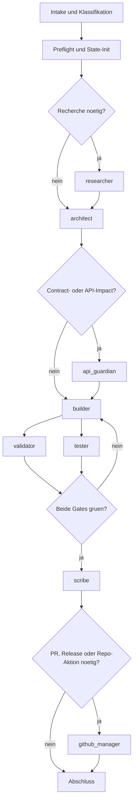

# Blueprint: Codex GodMode

Stand: 2026-03-16

Diese Datei ist die zentrale Architektur-Blueprint fuer die Codex-native Portierung von [cubetribe/ClaudeCode_GodMode-On](https://github.com/cubetribe/ClaudeCode_GodMode-On).

Ziel ist nicht, die Claude-Umsetzung blind zu kopieren. Ziel ist, das dort bewiesene Orchestrierungsmuster in eine moderne Codex-Struktur zu uebersetzen, die mit aktuellen Codex-Subagents, `AGENTS.md`, `.codex/config.toml`, projekt-spezifischen Custom Agents und klaren Repo-Artefakten arbeitet.

## Stage 1 - Research Codex Super-Agent orchestration capabilities

### Findings

- Aktuelle Codex-Doku beschreibt das Thema unter `Subagents`, nicht als separates "Super-Agent"-Produkt.
- Codex kann spezialisierte Agents parallel spawnen und deren Ergebnisse wieder im Haupt-Thread konsolidieren.
- Subagent-Workflows sind laut aktueller Doku in aktuellen Releases standardmaessig verfuegbar, werden aber nur ausgefuehrt, wenn sie explizit angefordert werden.
- Built-in Rollen sind derzeit `default`, `worker` und `explorer`.
- Projekt-spezifische Custom Agents leben unter `.codex/agents/*.toml`.
- Wiederverwendbare Prozeduren leben weiter unter `.agents/skills/`.
- `AGENTS.md` bleibt die zentrale, gelayerte Guidance-Ebene fuer globale und repo-nahe Regeln.

### Architecture Notes

- Codex trennt sauber zwischen Guidance (`AGENTS.md`), technischer Konfiguration (`.codex/config.toml`), Custom Agents (`.codex/agents/*.toml`) und Skills (`.agents/skills/`).
- Die aktuelle Doku empfiehlt parallele Agentenarbeit vor allem fuer read-heavy Aufgaben wie Recherche, Mapping oder Review.
- Schreibende Arbeit sollte eng gefuehrt werden, damit es keine Edit-Konflikte, Kontextverschmutzung oder unklare Ownership gibt.

### Key Decisions

- Die Portierung wird um explizite Subagent-Aufrufe herum entworfen, nicht um verdeckte Hook-Automatik.
- Rollen werden als schmale, fokussierte Agents modelliert.
- Wiederverwendbare Prozeduren werden spaeter als Skills ausgelagert, wenn der Ablauf stabil genug ist.

### Next Step

- Das originale Claude-System als Architektur und nicht nur als Prompt-Sammlung zerlegen.

## Stage 2 - Repository analysis of `ClaudeCode_GodMode-On`

### Findings

- Das Ausgangsrepo ist ein gesteuertes Workflow-System, nicht nur eine Sammlung von Rollenprompts.
- Das zentrale Muster ist: nicht-implementierender Orchestrator -> Spezialrollen -> file-basierte Report-Handoffs -> Qualitaetsgates -> Ruecksprung zum Builder.
- Die wichtigsten Laufzeitrollen im Claude-System sind:
  - `researcher`
  - `architect`
  - `api-guardian`
  - `builder`
  - `validator`
  - `tester`
  - `scribe`
  - `github-manager`
- Kommunikation passiert dort stark ueber Report-Dateien unter `reports/v[VERSION]/...`, nicht nur ueber Chat-Kontext.
- Der staerkste Kontrollmechanismus ist das kombinierte Qualitaetsgate: `validator` und `tester` muessen beide gruene Ergebnisse liefern, bevor dokumentiert oder abgeschlossen wird.

### Architecture Notes

- Das Claude-System gewinnt Stabilitaet nicht durch "ein sehr schlauer Agent", sondern durch enge Rollentrennung und klar definierte Handoffs.
- Die Runtime rechnet mit langen Sitzungen und Kontextverlust; deshalb existieren dort eigene State- und Context-Restore-Mechanismen.
- Einige Details der vorhandenen Implementierung sind inkonsistent und sollten nicht 1:1 uebernommen werden, insbesondere beim State-Schema.

### Key Decisions

- Erhalten werden Rollenmodell, Gate-Logik, Report-Kontrakte und explizite Freigabegrenzen.
- Nicht erhalten wird die Vermischung aus Hook-Magie, Prompt-Pack und uneinheitlichem State-Contract.

### Next Step

- Das extrahierte Muster auf Codex-native Bausteine abbilden.

## Stage 3 - Codex-native architecture design

### Findings

- Die Codex-native Uebersetzung braucht keinen "Alleskoenner-Agenten", sondern einen klar gefuehrten Haupt-Thread plus Custom Agents.
- Die passende Repo-Struktur ist:
  - `AGENTS.md` fuer die Orchestrator-Verfassung
  - `.codex/config.toml` fuer technische Defaults und `[agents]`-Grenzen
  - `.codex/agents/*.toml` fuer spezialisierte Rollen
  - `.agents/skills/` fuer spaetere wiederverwendbare Prozeduren
  - `reports/` und `state/` fuer persistente Artefakte
- Harte Regeln wie "nicht pushen ohne Freigabe" duerfen technisch abgesichert werden, aber die zentrale Ablaufsteuerung soll im orchestrierten Codex-Workflow bleiben.

### Architecture Notes

- Der Haupt-Thread bleibt Orchestrator und besitzt die Ablaufverantwortung.
- `builder` bleibt der einzige Agent mit schreibender Verantwortung.
- `validator` und `tester` duerfen parallel laufen, weil sie read-heavy und pruefend arbeiten.
- `api_guardian` ist ein bedingter Gate-Agent und wird nur bei API-, Schema-, CLI- oder Config-Impact gezogen.
- `scribe` und `github_manager` laufen erst, wenn die Qualitaetsgates gruen sind.

### Key Decisions

- Ein konsistentes, neues State-Schema wird eingefuehrt statt die inkonsistenten Claude-Strukturen mitzuschleppen.
- Report-Dateien bleiben Teil des Zielsystems, weil sie Resume, Audit und Review vereinfachen.
- Hooks werden auf Guardrails reduziert; der eigentliche Orchestrierungsfluss bleibt explizit im Codex-Thread.

### Next Step

- Den Laufzeitfluss und die Agentenkommunikation als konkreten Workflow ausformulieren.

## Stage 4 - Workflow design for Codex

### Findings

- Der geplante Laufzeitfluss lautet:
  1. Intake und Task-Klassifikation
  2. Preflight und State-Initialisierung
  3. optional `researcher`
  4. `architect`
  5. bedingt `api_guardian`
  6. `builder`
  7. parallel `validator` und `tester`
  8. Gate-Entscheidung: fertig oder Ruecksprung zu `builder`
  9. `scribe`
  10. optional `github_manager`
- Der Haupt-Thread muss explizit sagen, wann Subagents gestartet, abgewartet, wiederverwendet oder geschlossen werden.
- Resume darf sich nicht auf Chat-Historie allein verlassen; der State muss ausserhalb des Threads nachvollziehbar bleiben.

### Architecture Notes

- Das System sollte so entworfen werden, dass Parallelarbeit moeglich ist, ohne dass mehrere Builder gleichzeitig dieselben Dateien schreiben.
- Fehler- und Retry-Logik gehoeren in den Orchestrator-Vertrag:
  - Tool/MCP transient fehlgeschlagen -> einmal retry
  - Qualitaetsgate rot -> Ruecksprung zum `builder`
  - Architekturfrage aufgedeckt -> Ruecksprung zum `architect`
- Push, Merge und Deploy bleiben separate menschliche Freigabepunkte.

### Key Decisions

- Die Portierung orientiert sich an einem expliziten Entscheidungskreis statt an "Automatik im Hintergrund".
- Die Runtime soll Ergebnisse verdichten, nicht alle Agenten-Kontexte in den Haupt-Thread kopieren.
- "Hotfix" bedeutet in Codex hoechstens ein Fast-Pass-Architekturcheck, aber kein kompletter Verzicht auf Architektur.

### Next Step

- Die Blueprint in Repo-Struktur, Agentendefinitionen, State-Schema und spaetere Referenzimplementierung ueberfuehren.

## Zielbild als Ablauf

## Benoetigte Laufzeit-Agenten

| Rolle | Aufgabe | Schreibrechte |
| --- | --- | --- |
| `orchestrator` | intake, routing, state, gates, approvals | nein |
| `researcher` | externe oder interne Recherche, Kontextgewinn | nein |
| `architect` | Zielstruktur, Schnittstellen, Plan, Risiken | nein |
| `api_guardian` | API-, Schema-, CLI- und Config-Impact pruefen | nein |
| `builder` | kleinste vertretbare Aenderung implementieren | ja |
| `validator` | statische und strukturelle Validierung | nein |
| `tester` | reproduzierbare Ausfuehrungs- und Testpruefung | nein |
| `scribe` | changelog, docs, release-notes, Abschlussartefakte | begrenzt auf Doku |
| `github_manager` | PR-, Branch- und Release-bezogene Repo-Arbeit | nein, ausser explizit angefordert |

## Invarianten des Zielsystems

- Der Orchestrator implementiert nicht selbst.
- `builder` ist der einzige normale Code-Schreiber.
- `validator` und `tester` sind beide Pflicht fuer ein gruennes Qualitaetsgate.
- `api_guardian` ist Pflicht, wenn Vertragsflaechen betroffen sind.
- Push und Deploy passieren nie ohne explizite menschliche Zustimmung.
- State und Reports sind die Resume-Quelle, nicht nur der Chat-Verlauf.

## Vorgesehene Artefakte

Noch nicht implementiert, aber als Ziel definiert:

- `reports/v{workflow_version}/NN-role-report.md`
- `state/workflow-state.json`
- `docs/` fuer Architektur- und Betriebsdokumentation
- spaeter `.codex/agents/*.toml` fuer die Rollen
- spaeter `.agents/skills/` fuer wiederverwendbare Prozeduren

## Warum diese Portierung sinnvoll ist

Die Claude-Vorlage hat bereits gezeigt, dass das eigentliche Wertversprechen nicht im Modellnamen liegt, sondern in:

- harter Rollentrennung
- kontrollierten Handoffs
- nachvollziehbaren Gates
- sauberer menschlicher Freigabe bei riskanten Aktionen

Codex bringt dafuer heute die nativen Bausteine mit. Diese Repo sorgt dafuer, dass daraus keine lose Sammlung von Ideen wird, sondern ein dokumentiertes, versionierbares und spaeter implementierbares System.

## Quellen

- Ausgangsrepo: [cubetribe/ClaudeCode_GodMode-On](https://github.com/cubetribe/ClaudeCode_GodMode-On)
- Codex Docs: [Subagents](https://developers.openai.com/codex/subagents/)
- Codex Docs: [Agent Skills](https://developers.openai.com/codex/skills/)
- Codex Docs: [Custom instructions with AGENTS.md](https://developers.openai.com/codex/guides/agents-md/)
- Codex Docs: [Configuration reference](https://developers.openai.com/codex/config-reference/)
