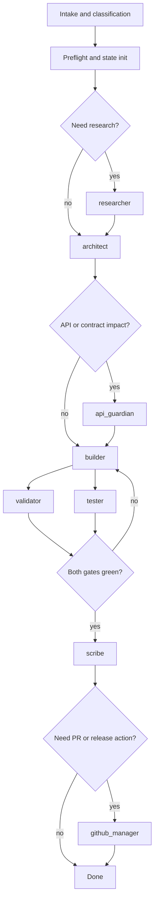

# Blueprint: Codex GodMode

Updated: 2026-05-08

This document is the core architecture blueprint for the Codex-native port of [cubetribe/ClaudeCode_GodMode-On](https://github.com/cubetribe/ClaudeCode_GodMode-On).

`1.0.0` is the first release where this blueprint matches an installable runtime package instead of only a target design.

The goal is not to copy the Claude implementation blindly. The goal is to preserve the proven orchestration pattern and translate it into a modern Codex structure built around:

- `AGENTS.md`
- `.codex/config.toml`
- `.codex/agents/*.toml`
- `.agents/skills/`
- persistent `reports/` and `state/`

## Current 1.0 Runtime

The repository now ships:

- a global installer that publishes guidance, config, agents, and skills to the user's Codex home
- eight core role agents for the normal workflow
- five optional department agents for large cross-domain work
- nine reusable skills covering the normal workflow, debug lane, review lane, department routing, greenfield bootstrap, stack guidance, and release framing
- local checks that verify both the repo package and the installed global runtime

The runtime is intentionally explicit. The main thread remains responsible for deciding when to use a specialist, when to wait for results, when to loop back, and when to stop for human approval.

## Stage 1: Research Codex orchestration capabilities

### Findings

- Current Codex documentation describes the feature as `Subagents`, not as a separate “super-agent” product.
- Codex can spawn specialized agents in parallel and consolidate their output in the main thread.
- Current Codex releases enable subagent workflows by default, but Codex only spawns subagents when explicitly asked.
- Subagents inherit the parent sandbox and approval state, and live parent runtime overrides are reapplied to children.
- The built-in role types are `default`, `worker`, and `explorer`.
- Project-specific custom agents belong in `.codex/agents/*.toml`.
- Reusable procedures belong in `.agents/skills/`.
- Skills use progressive disclosure: metadata is visible first, and `SKILL.md` is loaded only when the skill is selected.
- `AGENTS.md` remains the main layered guidance mechanism.

### Architecture notes

- Codex cleanly separates guidance, technical configuration, custom agents, and reusable skills.
- Parallel subagents are best for read-heavy tasks such as research, mapping, and review.
- Write-heavy work should stay narrowly owned to avoid edit conflicts and unclear responsibility.
- Multi-agent splits are worthwhile only when they improve capability isolation, policy isolation, prompt clarity, trace legibility, or parallel read-heavy work.
- Prompt and workflow quality should be validated with concrete checks where possible, such as trigger behavior, command execution, handoff accuracy, and final-answer correctness.

### Key decisions

- This port will be built around explicit subagent calls, not hidden hook automation.
- Roles will stay narrow and focused.
- Stable repeated procedures belong in focused skills.

## Stage 2: Analyze `ClaudeCode_GodMode-On`

### Findings

- The source repository is a managed workflow system, not just a set of prompts.
- Its core pattern is:
  - non-implementing orchestrator
  - specialist roles
  - file-based report handoffs
  - quality gates
  - return loop back to the builder
- The main runtime roles are:
  - `researcher`
  - `architect`
  - `api_guardian`
  - `builder`
  - `validator`
  - `tester`
  - `scribe`
  - `github_manager`
- Communication relies heavily on report files rather than only on chat context.
- The strongest control mechanism is the dual quality gate: `validator` and `tester` both need to pass.

### Architecture notes

- Stability comes from strict role separation and clear handoffs, not from one oversized generalist agent.
- The original system expects long sessions and context loss, which is why it keeps its own state and restore mechanics.
- Some implementation details in the Claude repo are inconsistent and should not be copied as-is.

### Key decisions

- Preserve the role model, gate logic, report contracts, and explicit approval boundaries.
- Do not preserve the mix of hook magic, prompt pack behavior, and inconsistent state schemas.

## Stage 3: Codex-native target architecture

### Findings

- The Codex-native version does not need an all-purpose agent. It needs an explicit orchestrator plus focused custom agents.
- The target repository structure is:
  - `AGENTS.md` for the orchestrator constitution
  - `.codex/config.toml` for technical defaults and `[agents]` limits
  - `.codex/agents/*.toml` for role definitions
  - `.agents/skills/` for reusable procedures
  - `reports/` and `state/` for persistent artifacts

### Architecture notes

- The main thread remains the orchestrator and owns routing, gates, and approvals.
- `builder` stays the only normal code-writing role.
- `validator` and `tester` may run in parallel because they are validation-oriented and mostly read-heavy.
- `api_guardian` is conditional and activates only when API, schema, CLI, or config surfaces are affected.
- `scribe` and `github_manager` run only after the quality gate is green.

### Key decisions

- Introduce one clean state schema instead of carrying forward the inconsistent Claude state model.
- Keep report files in the design because they improve resume, auditability, and review.
- Reduce hooks to guardrails. Keep the real orchestration flow explicit in Codex.

## Stage 4: Runtime workflow design

### Findings

The target runtime loop is:

1. intake and task classification
2. preflight and state initialization
3. optional `researcher`
4. `architect`
5. conditional `api_guardian`
6. `builder`
7. parallel `validator` and `tester`
8. gate decision: done or back to `builder`
9. `scribe`
10. optional `github_manager`

### Architecture notes

- The main thread must explicitly say when subagents are started, waited on, reused, or closed.
- Resume cannot depend on chat history alone; state must stay visible outside the thread.
- Parallelism should never turn into multiple builders writing the same files.
- Use `Goal`, `Context`, `Constraints`, and `Done when` as the default task frame when the user has not already supplied equivalent structure.
- For long-horizon work, keep durable project memory in markdown reports, state files, or specs that can be re-read after compaction or resume.

### When to use multi-agent routing

Start with one agent whenever possible. Add specialists when one of these signals is present:

- the task crosses runtime, workflow, governance, docs, or validation ownership
- a specialist needs different tools, policy, or instructions
- read-heavy exploration, verification, or source research can run independently
- eval or review evidence shows routing, tool selection, or handoff accuracy is a risk

Avoid extra agents when they only add more prompts, approval surfaces, latency, or token cost without clarifying the work.

### Error and retry model

- transient tool or MCP failure: retry once
- red quality gate: loop back to `builder`
- uncovered architecture issue: loop back to `architect`
- push, merge, or deploy: always require an explicit human decision

## Target flow

```mermaid
flowchart TD
    A["Intake and classification"] --> B["Preflight and state init"]
    B --> C{"Need research?"}
    C -->|yes| D["researcher"]
    C -->|no| E["architect"]
    D --> E
    E --> F{"API or contract impact?"}
    F -->|yes| G["api_guardian"]
    F -->|no| H["builder"]
    G --> H
    H --> I["validator"]
    H --> J["tester"]
    I --> K{"Both gates green?"}
    J --> K
    K -->|no| H
    K -->|yes| L["scribe"]
    L --> M{"Need PR or release action?"}
    M -->|yes| N["github_manager"]
    M -->|no| O["Done"]
    N --> O
```

## Runtime roles

| Role | Responsibility | Write access |
| --- | --- | --- |
| `orchestrator` | intake, routing, state, gates, approvals | no |
| `researcher` | external or internal research | no |
| `architect` | target structure, interfaces, risks, plan | no |
| `api_guardian` | API, schema, CLI, and config impact review | no |
| `builder` | smallest safe implementation | yes |
| `validator` | structural and static validation | no |
| `tester` | executable and test validation | no |
| `scribe` | changelog, docs, release notes, completion artifacts | docs only |
| `github_manager` | PR, release, and repo-facing coordination | no by default |

## Optional department agents

Department agents are not the default path. They exist to clarify ownership when a task spans multiple domains.

| Agent | Responsibility | Write access |
| --- | --- | --- |
| `runtime_platform` | Codex runtime defaults, toolchains, sandboxing, and environment behavior | no |
| `workflow_design` | workflow procedures, skill boundaries, and handoff artifacts | no |
| `workspace_governance` | AGENTS layering, release law, branch policy, and repo rules | no |
| `quality_operations` | validation plans, install checks, smoke paths, and eval-oriented checks | no |
| `docs_dx` | README, setup docs, prompts, and contributor-facing clarity | no |

## Invariants

- The orchestrator does not implement code itself.
- `builder` is the only normal code-writing role.
- `validator` and `tester` are both required for a green quality gate.
- `api_guardian` is required when contract surfaces are touched.
- Department agents are advisory unless the parent workflow explicitly assigns a bounded write scope.
- Push and deploy never happen without explicit human approval.
- State and reports are the resume source of truth, not chat history alone.

## Planned artifacts

Current conventions:

- `reports/generated/NN-role-report.md`
- `state/workflow-state.local.json`
- `docs/` for architecture and operations
- `.codex/agents/*.toml` for role definitions
- `.agents/skills/` for reusable procedures

Future work may add stricter schemas or automated checks for these artifacts. Today they are conventions, not a separate runtime engine.

## Release boundary

The 1.0 release is a runtime-package milestone. It does not claim:

- automatic state-machine execution outside Codex
- hidden auto-spawning of subagents
- automatic report or state schema enforcement
- CI/CD, deployment, or GitHub release automation

Those are future hardening areas. The current contract is a documented, installable, validated Codex workflow package.

## Why this port matters

The Claude template already proved that the value is not the model name. The value comes from:

- hard role separation
- controlled handoffs
- auditable gates
- clear human approval for risky actions

Codex now has the native building blocks for that pattern. This repo exists to turn those ideas into a documented, versioned, and eventually fully implemented system.

## Sources

- Source repo: [cubetribe/ClaudeCode_GodMode-On](https://github.com/cubetribe/ClaudeCode_GodMode-On)
- Codex docs: [Subagents](https://developers.openai.com/codex/subagents/)
- Codex docs: [Subagent concepts](https://developers.openai.com/codex/concepts/subagents)
- Codex docs: [Agent Skills](https://developers.openai.com/codex/skills/)
- Codex docs: [Custom instructions with AGENTS.md](https://developers.openai.com/codex/guides/agents-md/)
- Codex docs: [Configuration reference](https://developers.openai.com/codex/config-reference/)
- Codex docs: [Best practices](https://developers.openai.com/codex/learn/best-practices)
- OpenAI API docs: [Agents orchestration](https://developers.openai.com/api/docs/guides/agents/orchestration)
- OpenAI API docs: [Evaluate agent workflows](https://developers.openai.com/api/docs/guides/agent-evals)
- OpenAI Developers blog: [Testing Agent Skills Systematically with Evals](https://developers.openai.com/blog/eval-skills)
- OpenAI Developers blog: [Run long horizon tasks with Codex](https://developers.openai.com/blog/run-long-horizon-tasks-with-codex)
