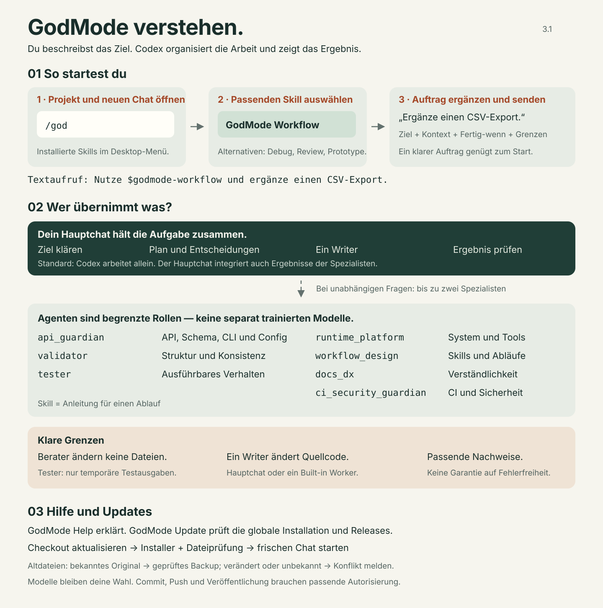

# GodMode Core für Codex benutzen

GodMode Core gibt Codex wiederverwendbare Abläufe und bei Bedarf spezialisierte
Agenten. Du beschreibst das gewünschte Ergebnis; Codex organisiert die Arbeit.
Ein Skill ist die Anleitung für einen Ablauf. Ein Agent übernimmt einen
begrenzten Unterauftrag mit eigenen Rollenregeln und Berechtigungen.

Dieses Community-Paket installierst und betreibst du selbst. Die separate
Pro-Anwendung und die Claude-Variante findest du in der
[Produktfamilien-Übersicht](product-family.md).



## In 30 Sekunden starten

1. Öffne dein Projekt und einen frischen Codex-Chat nach der Installation.
2. Tippe in der Desktop-Eingabe `/god` und wähle **GodMode Core Workflow** aus
   den angebotenen Skills. Ältere Installationen zeigen **GodMode Workflow**;
   die Core-Anzeigenamen werden seit 3.1.1 verwendet.
3. Ergänze deinen Auftrag und sende ihn ab. Die Auswahl legt den Ablauf fest;
   erst dein Auftrag sagt Codex, was es erreichen soll.

Die Oberfläche kann sich je nach Client unterscheiden. Der eindeutige
Textaufruf funktioniert mit dem installierten Skillnamen:

```text
Nutze $godmode-workflow und ergänze einen CSV-Export.
Kontext: die vorhandene Exportansicht.
Fertig, wenn: die CSV mit den richtigen Spalten heruntergeladen werden kann.
Grenzen: Der JSON-Export soll weiter funktionieren.
```

`/god` ist eine Suche im Skill-Menü; wir installieren keinen eigenen eingebauten
Slash-Befehl `/godmode`. Du musst keine Agentennamen, Delegationsverträge oder
internen Phasen in deinen Auftrag schreiben.

## Den passenden Ablauf wählen

| Auswahl | Wann sie hilft | Was du mitgibst |
| --- | --- | --- |
| GodMode Core Workflow | Etwas bauen, ändern oder migrieren | Ziel und erkennbares Ergebnis |
| GodMode Core Debug | Ein Fehler soll behoben werden | Verhalten, Erwartung und Reproduktion |
| GodMode Core Review | Eine Änderung beurteilen | Dateien, Diff oder Vergleichsbasis |
| GodMode Core Prototype | Eine Idee lokal ausprobieren | Idee und wichtigste Funktion |
| GodMode Core Help | Bedienung verstehen oder eigene Regeln prüfen | Deine Frage oder der gewünschte Konfigurationscheck |
| GodMode Core Update | Installation prüfen oder aktualisieren | Diagnose oder Update, gegebenenfalls Quellpfad |

Workflow, Debug, Review und Prototype sind alternative Arbeitsmodi. Help und
Update sind Hilfe und Wartung. Paperwork ist ein separat installiertes Plugin.
Ein Prototype ist ein lokales Experiment; seine Überführung in Produktion
beginnt mit einem neuen Produktionsauftrag.

Ohne Auftrag erklärt ein Arbeitsmodus kurz den Einstieg. Mit einem klaren
Auftrag beginnt er direkt. Hilfe wird in deiner Sprache gegeben. Du kannst
jederzeit schreiben: „Erkläre mir diesen Schritt“ oder `$godmode-help` wählen.
Es gibt keinen verpflichtenden Begrüßungsdialog bei jeder Aufgabe.

## Warum es Agenten gibt

Dein Hauptchat bleibt verantwortlich. Er entscheidet, schreibt oder setzt einen
einzigen Writer ein und führt Ergebnisse zusammen. Normalerweise arbeitet er
allein. Bis zu zwei Spezialisten helfen bei unabhängigen Fragen, wenn das den
Auftrag verbessert. Mehr Agenten sind kein Qualitätsversprechen; sie brauchen
zusätzlichen Kontext, Zeit und Modellnutzung.

| Agent | Aufgabe | Grenze |
| --- | --- | --- |
| `api_guardian` | Prüft API-, Schema-, CLI- und Config-Verträge | Berät; implementiert nicht |
| `validator` | Prüft Struktur und Konsistenz | Führt keine Laufzeitprüfung durch |
| `tester` | Reproduziert und prüft ausführbares Verhalten | Nur temporäre Ausgaben; keine Quellcodeänderung |
| `runtime_platform` | Klärt Betriebssystem, Tools oder Sandbox | Berät zu einer begrenzten Frage |
| `workflow_design` | Prüft Skill-, Prompt- und Ablaufentscheidungen | Steuert nicht eigenständig das Projekt |
| `docs_dx` | Prüft verständliche öffentliche Anleitung | Berät; schreibt keine parallele Änderung |
| `ci_security_guardian` | Prüft CI und Repository-Sicherheit | Veröffentlicht und deployt nicht |

Agenten sind Rollen mit Anweisungen und Berechtigungen, keine separat trainierten
Modelle. Sie delegieren nicht weiter. Modell und Denkintensität bleiben deine
Einstellungen. Eine Prüfung liefert Nachweise für ihren Umfang und garantiert
keine allgemeine Fehlerfreiheit. Commit, Push und Veröffentlichung benötigen
die jeweilige Autorisierung.

## Eigene Regeln und Einstellungen prüfen

Seit 3.1.1 kann Help globale und projektlokale Anweisungen sowie relevante Codex-Einstellungen
lesend vergleichen. Das hilft etwa, wenn Regeln aus `AGENTS.md`, einem Override
oder einem Profil unerwartet greifen, sich widersprechen oder veraltet wirken.

```text
Nutze $godmode-help und prüfe meine lokalen Anweisungen und Codex-Einstellungen.
Zeige Überschneidungen, widersprüchliche oder veraltete Regeln mit Fundstellen
und konkreten Verbesserungsvorschlägen. Ändere keine Dateien.
```

Der Bericht unterscheidet Widersprüche, nachweislich übersteuerte Einstellungen,
bestätigte Alt-Konfigurationen und optionale Vereinfachungen. Eine bewusste
Modellwahl, strengere Berechtigungen oder zusätzliche Projektprüfungen sind
keine Fehler. Help zeigt, welche Vorgabe für den geprüften Bereich gilt und
welche Wirkung eine vorgeschlagene Änderung hätte. Aussagen über aktuelle
Best Practices brauchen passende offizielle Quellen; fehlende Nachweise
bleiben als ungeklärt sichtbar.

Geprüft werden die passenden Dateien im aktuellen Projekt und Codex-Home.
Dateien auf der Festplatte können vom bereits geladenen Chat-Kontext abweichen;
unbekannte Profile, Startoptionen oder verwaltete Vorgaben begrenzen die Aussage.
Help schreibt keine Konfiguration um und setzt keine Nutzervorgaben zurück.
Bei normalen Bedienfragen genügt eine kurze Erklärung; der Dateicheck startet
bei einer passenden Diagnosefrage oder einem ausdrücklichen Prüfauftrag.
Die Kontrolle installierter Paketdateien und deren Aktualisierung übernimmt Update.

## Updates und alte Menüeinträge

Ein `git pull` aktualisiert den Quellcode im Checkout. Globale Dateien werden
erst durch den Installer aktualisiert. Ein bereits laufender Chat kann zuvor
geladene Anweisungen behalten. Das sind drei verschiedene Zustände.

```text
Nutze $godmode-update und prüfe meine Installation sowie verfügbare Releases.
Zeige mir zuerst Unterschiede und Konflikte.
```

Der Audit liest den Installationsbeleg, prüft die tatsächlichen Dateien, beide
globalen Skill-Orte und die öffentliche GitHub-Releaseinformation. Ohne
Netzwerk ist der veröffentlichte Stand unbekannt. Die Prüfung allein verändert
keine Dateien. Bei einem Update werden aktive Paketdateien nach Backup ersetzt.
Unveränderte bekannte Altdateien werden nach geprüftem Backup entfernt;
bearbeitete oder unbekannte Altdateien bleiben erhalten und blockieren den Lauf.
Eigene Dateinamen werden nicht pauschal entfernt. Aktive Doppelkopien im anderen
Skill-Ort müssen zuerst bewusst aufgelöst werden.

Nach erfolgreichem Update: einen frischen Chat starten und das Menü prüfen.
`Godmode Departments` gehört seit 3.0 nicht mehr zum Core. Bleibt ein Eintrag
sichtbar, prüfen wir auch projektlokale Skills, Plugins, andere Hosts und den
geladenen Chat-Kontext. Der globale Audit behauptet nicht, diese Quellen alle
zu erfassen. Details: [Setup und Wiederherstellung](global-codex-setup.md).
